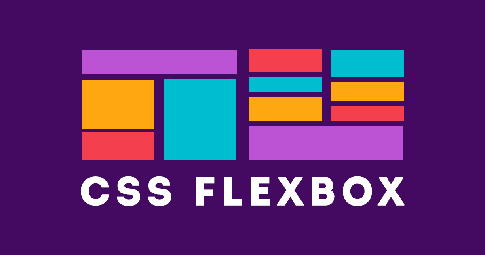

<h2 align="center">💡 Responsividade</h2>

  

  

  
  
  

  

  

  

## 📢 Sobre

O CSS Flexible Box Layout, conhecido como Flexbox, é um modelo de layout da Web CSS3. Está no estágio de recomendação de candidatos (CR) do W3C. O layout flexível permite que os elementos responsivos dentro de um contêiner sejam organizados automaticamente, dependendo do tamanho da tela (ou dispositivo).

Este repositório vai contar com projetos de com nível iniciante até o avançado, onde será demonstrado o poder do flexbox.

## 🤔 Como Contribuir

**Encare essa contribuição como uma forma de consolidar seu conhecimento sobre git e gitbub, todo e qualquer feedback será bem vindo.**

> -  Faça fork do repositório
> -  Crie uma nova branch **git checkout -b my feature**
> -  Faça um commit **git commit -m "feat: My new feature"**
> -  Envie sua branch para seu repositório forkado **git push origin my feature**
> -  Crie um novo Pull Request informando sobre suas alterações e aguarde para obter reposta sobre o mesmo.

## :memo: Licença

Esse projeto está sob a licença MIT. Veja o arquivo [LICENSE](https://raw.githubusercontent.com/kaiorr/flexbox/master/LICENSE) para mais detalhes.

----

Feito com :heart: por **Kaio Ribeiro** :call_me_hand: [Professional-Network](https://www.linkedin.com/in/kaio-ribeiro-310123150/)